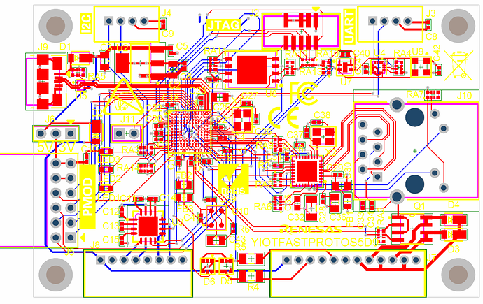
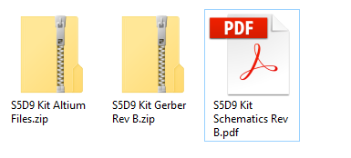

## Designing Your Own Board

[Download](http://learn.iotcommunity.io/t/s5d9-iot-fast-prot-kit-board-design-files/1104?u=craig) the open source design [files]((http://learn.iotcommunity.io/t/s5d9-iot-fast-prot-kit-board-design-files/1104?u=craig) ) to use as a starting point.

Renesas often uses Altium Designer, but you can use any PCB design software. Altium and Gerber files
are provided.
