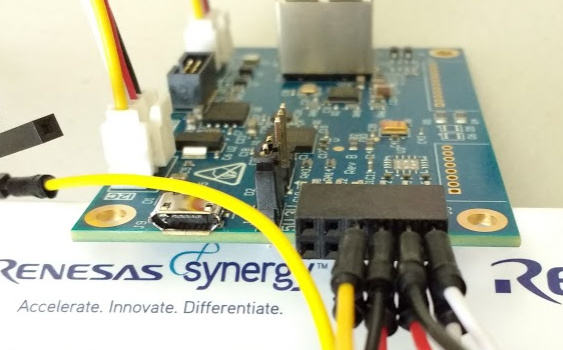

# Hacking the Renesas S5D9 IoT Fast Prototyping Kit

## Hacking Paths

1. Data Monitoring (Bug Labs default system image)
2. Data Intelligence (Medium One binaries and cloud-based workflows)
3. Renesas Synergy (Professional C/C++ development system)
    * Use factory default bootloader ('Put binary here' folder)
    * Replacing factory image with your own image
4. [Designing your own board](design/files.md)

## Before You Hack

* [technical requirements](requirements.md)

