[Activate](https://mediumone.com/partner/activate-rna.php?partner=renesas&boardtype=s5d9&kit=diagnostics_intelligence) your Renesas S5D9 Diagnostics Intelligence Kit. 

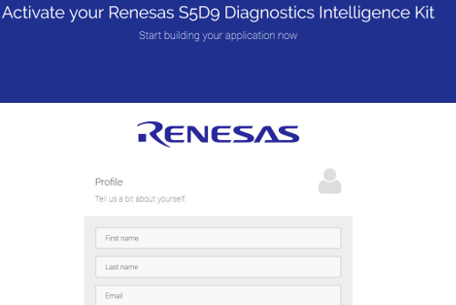

[Activate](https://mediumone.com/partner/activate-rna.php?partner=renesas&boardtype=s5d9&kit=diagnostics_intelligence)

After you press *Activate* it will take a few minutes for the system to send you an email.

### Download m1config.txt from your email

You will receive two emails. Open the one with the subject line, *Your S5D9 IoT Fast Prototyping Kit is activated*.

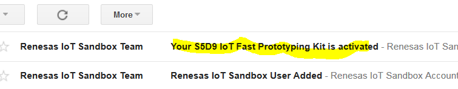

Scroll to the bottom of the email to see the attachment. Download the attachment *m1config.txt*.

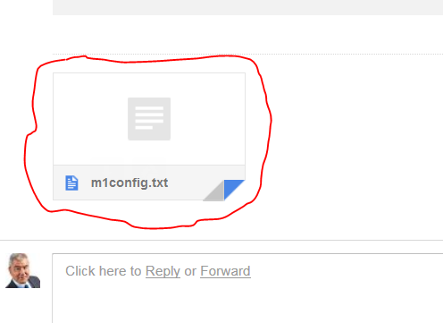

### Move m1config.txt to board

Copy the file you received in your email to the S5D9 you have connected to your computer with USB.

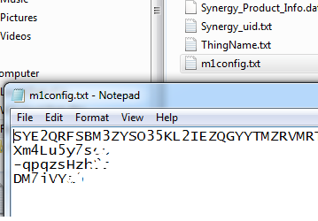

You can optionally verify that the contents of the file on the S5D9 board match the 
contents of the file on your workstation.

After the board boots the LED light will be solid green.

### Log Into Renesa IoT Sandbox Data Intelligence

[https://renesas-na-sandbox.mediumone.com/login]

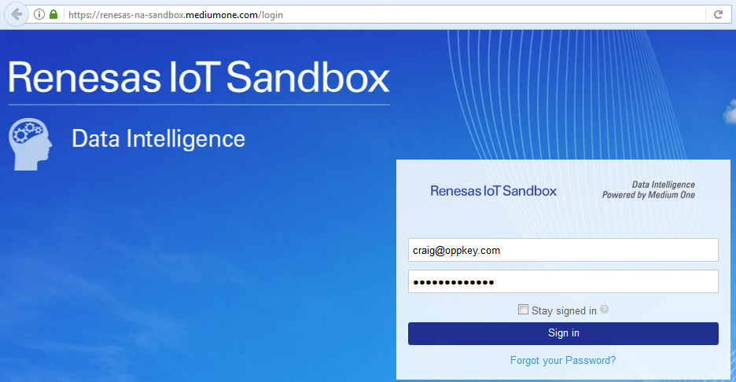

The login information is in a separate email.

After you log into the dashboard, select the project in the upper right. You named 
the project during the activation step above.

You must also select a user from the drop down menu. It will be a long string of digits.

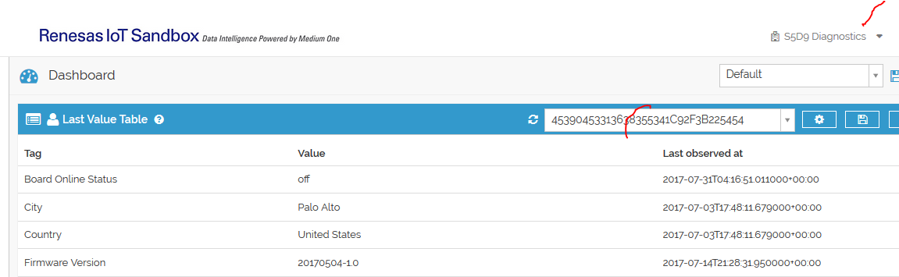

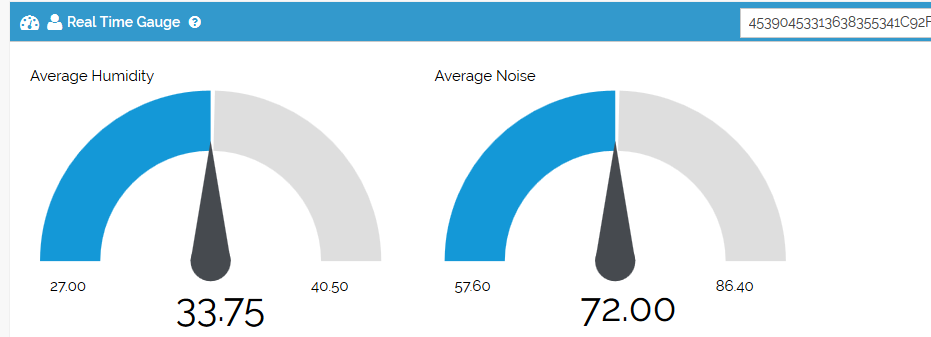

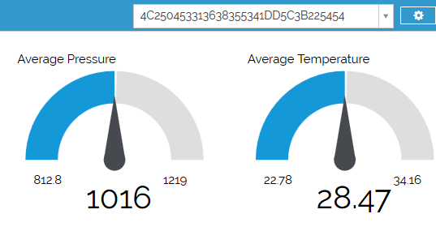

Once you have the user selected and can see the gauges, click on the *Save* button. Once
you Save the view, you do not have to select the user each time you log in.

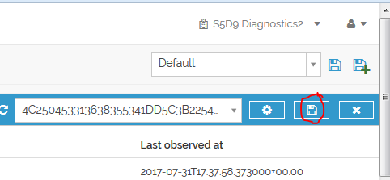

There are two types of events sent from the board to Renesas IoT Sandbox:

**Summary Events**

These events are always sent every 15 minutes by default. A summary event contains the average values from each of the sensor readings within the past 15 minutes. The sensors included are temperature, pressure, humidity, noise level, and vibration stats. To change the frequency of these summary events, view Appendix A .

**Threshold Events**

These events are sent whenever a sensor reading passes a certain threshold.  To change these thresholds, view the Appendix A

At the top of the Dashboard, you will see a **Last Value Table widget**. This widget only records the last entered value of that tag, along with the observed at timestamp (in UTC). You can use this widget to see the last time the board status was ‘on’ and the last values for city, country, firmware version, wan ip, lan ip, and mac address. For this tutorial, first make sure that your board is connected by seeing the rows filled with the value and timestamps. If there is nothing in the ‘value’ and ‘last observed at’ columns,  your board has had problems connecting to the cloud. You may need to click the refresh icon 

After your board has been connected for at least 15 minutes, it’s first summary event should be sent in. When this happens, the Gauge Widget on your Dashboard should be updated. These values are the averages of the sensor for the past 15 minutes. It will continue to be updated every time a summary event is received.

Next, you will see a Table widget. This widget presents all the data from the Humidity, Noise, Pressure, and Temperature sensors sorted by most recent. Using this widget, you can see the sensor value changes over time as well as the last time the board sent an ‘online event’. Click the refresh button 

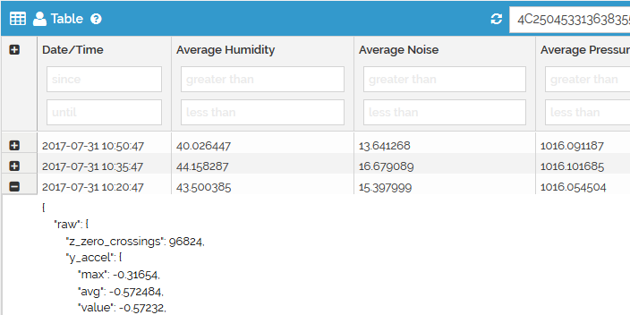

Under the table widget is the Cross Filter Widget. This widget displays board vibration data for the past day. Furthermore, you can add filters based on time range and vibration levels. To see refresh the widget and see updated data, click the refresh button .To customize this widget, view the diagram below and the captions that correspond to the numbers.

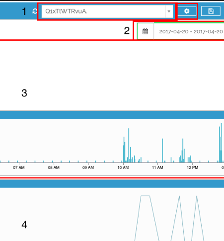

1. User selector. Here, you select the randomly generated username for your board. The red box next to it is the Tag selector. By default, it is ‘processed.vibration_status’.
2. Date selector. By default, it is the past 24 hours. You can customize the date range.
3. Filter charts. These charts are used to filter your data in the main chart (#4).
4. Main chart. Your values for the selected tag are displayed in this chart. You can filter the data by time of date, date range, and values by the filter charts (#3)

The last pre-set widget on the Dashboard is the User Input Widget. This widget does not display data but instead allows you to send data. For this tutorial, you will use this widget to control the LEDs in the next step. You will also use this widget to send a sample report later.

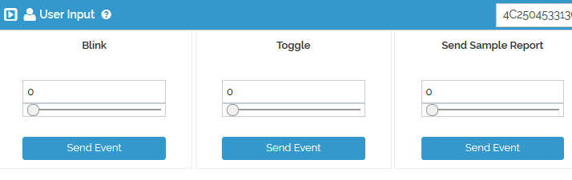

To learn more about widgets, check out Medium One's [Dashboard Widgets Documentation](http://renesas-docs.mediumone.com/?widgets).

### LED Toggle and Blink

Now we will send events from the cloud to the board to toggle and blink the LED lights.

**Blink**

On the User Input widget, go to the box that says ‘Blink’. Type in the number of times you wish to make the LED blink; for demo purposes, pick a number under 10, then click ‘Send Event’.

The red LED on the board will blink the number of times you specified. You should also see this event appear in the **Real Time Events Stream widget**.

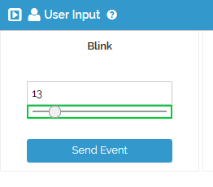

<iframe width="560" height="315" src="https://www.youtube.com/embed/yFiS_sxsHyQ" frameborder="0" allowfullscreen></iframe>

**Toggle**

On the User Input widget, go to the box that says ‘Toggle’. To turn on the yellow LED, type in ‘1’.  Click ‘Send Event’. You should see this event appear in the Real Time Events Stream Widget. The yellow LED on the board will also turn on. To turn it off, type in ‘0’ and click ‘Send Event’. If any number other than 0 or 1 is used, it will change states from off to on or vice versa.

To learn more about how toggle and blink works, view the ‘LED Toggle and Blink’ Workflow in Workflow Studio or view Appendix B .

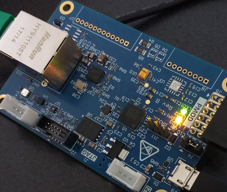

### Daily Email Report

The first step to set up your daily report is to add your email to the workflow. To do this on Renesas IoT Sandbox, click on ‘Workflow Studio’ on the sidebar. Next, click on the ‘Daily Report’ workflow:

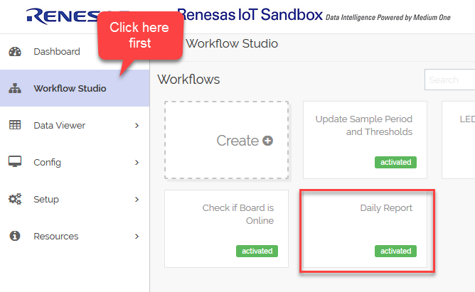

Inside of the workflow:

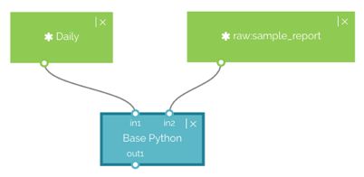

Double-click on ‘Base Python’ to edit this workflow’s code. After the import lines, you should see a line:

    “recipients = ‘email@mediumone.com’”

Change the email to your email. Click ‘Save and Activate’.

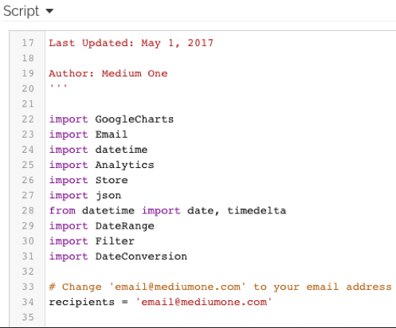

Now that you’ve got your email in the workflow, you can trigger the workflow to get a report. By default, the workflow is triggered daily at midnight (PT). If you wish to change this time, double-click the box labeled ‘Daily’ and change the settings there. For the tutorial, we will trigger this workflow now by sending the event {“sample_report”: 0} through the Dashboard.

Back on the Dashboard, scroll down until you see the User Input widget like below. Select your board’s username on the user dropdown.

To trigger the Daily Report Workflow, click the ‘Send Event’ button that is under ‘Send Sample Report’.

After a few seconds, you should have received a Daily Report in your email with statistics of the past 24 hours. 

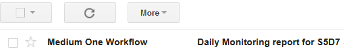

This report shows Temperature, Pressure, Humidity, Noise, and Vibration levels in Bar Charts. The sensor values are averaged and bucketed per hour.  There are also two pie charts that show the vibration status and board online status percentage. Lastly, there is a Geo map that provides your location based off of your ip address. Here is a sample report:

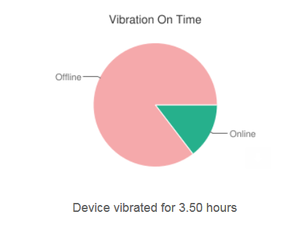

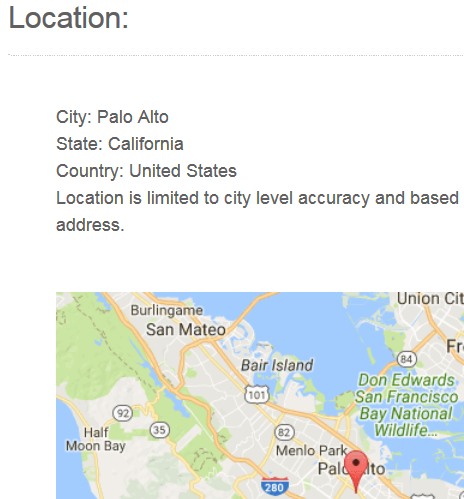

