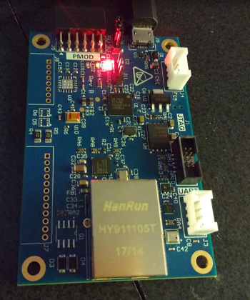
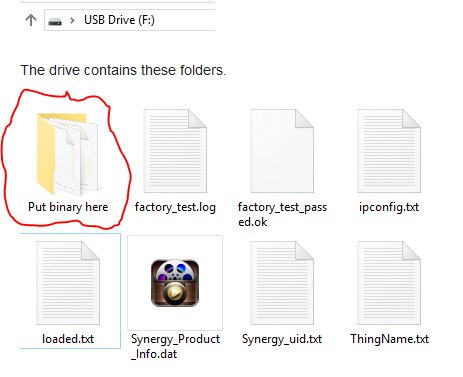
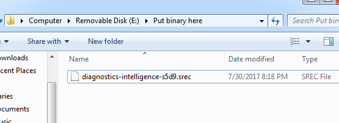
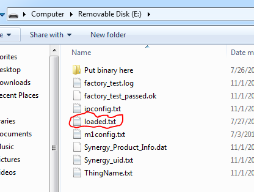
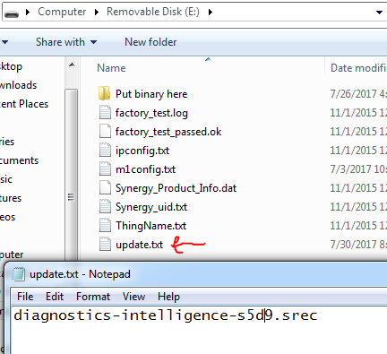

The S5D9 IoT Fast Prototyping Kit ships with both a boatloader and 
a default system image to connect to the Renesas Data Monitoring system (Bug Labs).

To use Data Intelligence (Medium One), you'll need to download a new binary to
your Windows workstation, then use the USB cable to move the binary from your
Windows computer to the S5D9. 

> NOTE: You cannot use a Mac for to move the binary.

With the S5D9 board plugged into USB only, the red LED of the board will
be on and the yellow LED will be flashing. The board will be trying to connect
to the Renesas Data Monitoring system.

> NOTE: There's been reports of slow data transmission speeds with the Ethernet plugged in.
Leave the Ethernet unplugged.

### Download Data Intelligence Binary 

[Download](http://learn.iotcommunity.io/t/s5d9-medium-one-diagnostics-intelligence-binary-file/1107)
Medium One's diagnostics-intelligence-s5d9.srec file.

On your Windows workstation, the S5D9 board will look like a USB drive. Move the binary you just 
downloaded in the folder `Put binary here`.

> NOTE: This process could take 7 minutes. Even though the binary is only 1.2M and
is moving data over USB, the process moves slowly.

After 7 minutes, the transfer completes.

### Configure Update Files

In the main directory, delete the file `loaded.txt`

Create a new file called `update.txt`

Add the name of the `.srec` file to the new file.

### Power Cycle Board

When you power cycle the board, the `update.txt` file will be automatically deleted.
A new `loaded.txt` file will be created. The `loaded.txt` file will contain
`diagnostics-intelligence-s5d9.srec`.

