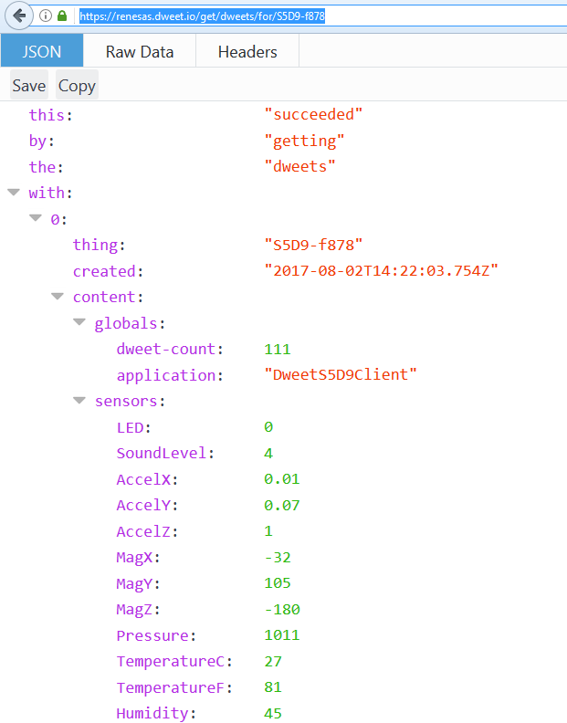
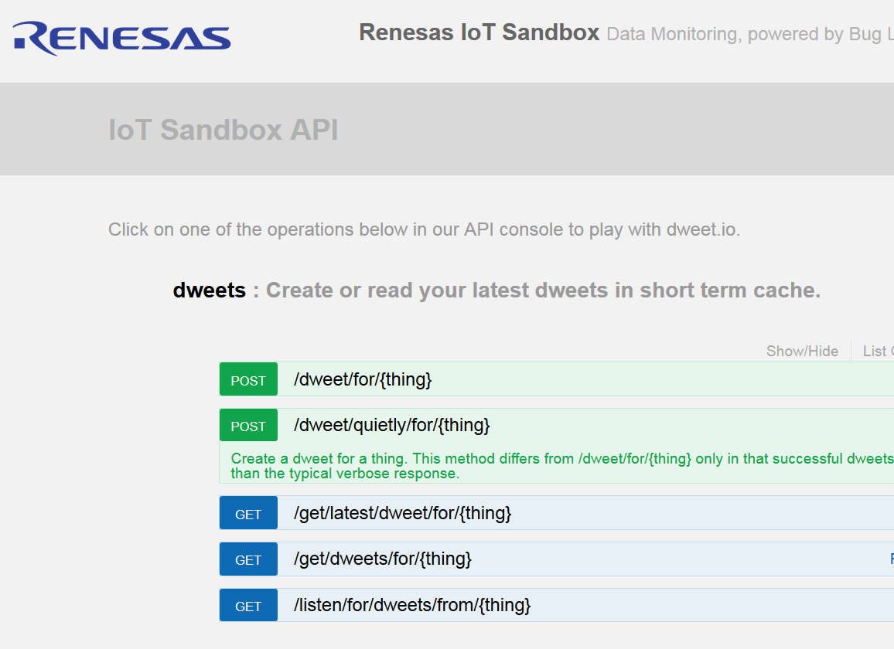
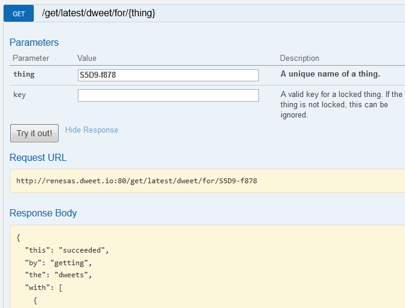
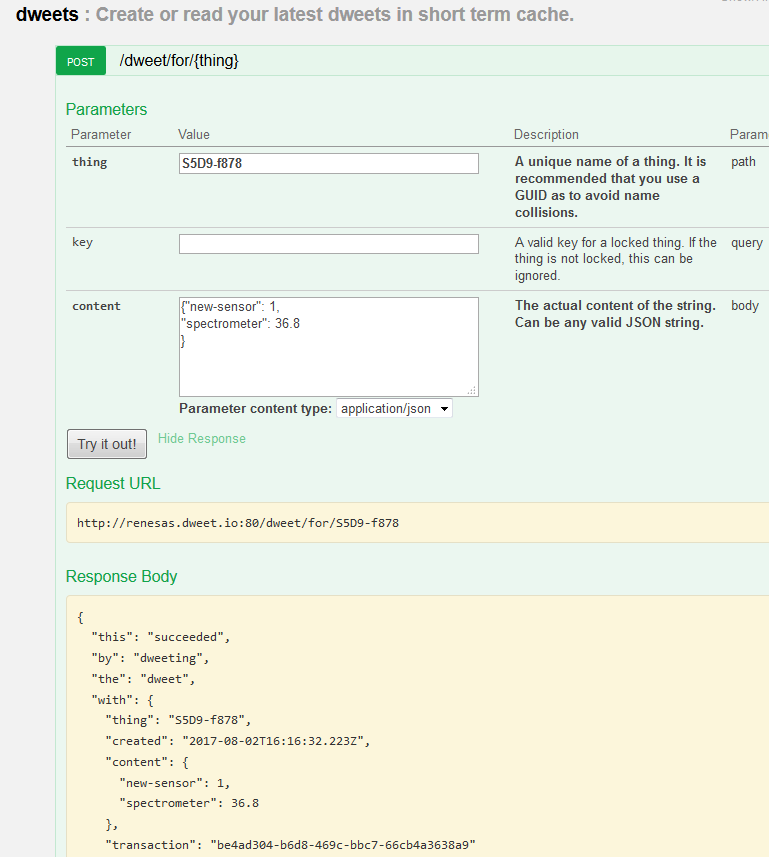
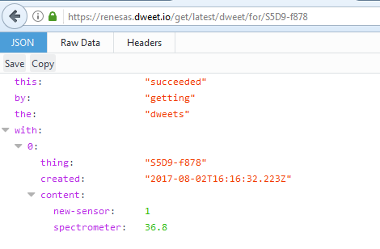

With your S5D9 plugged into both USB and Ethernet, modify this URL and put it into a browser.

    https://renesas.dweet.io/get/dweets/for/S5D9-f878

You can also use the IoT Sandbox API console.

[http://renesas.dweet.io/play/](http://renesas.dweet.io/play/)

Get the latest info from your S5D9.

        "sensors": {
          "LED": 0,
          "SoundLevel": 4,
          "AccelX": 0.02,
          "AccelY": 0.07,
          "AccelZ": 0.99,
          "MagX": -20,
          "MagY": 110,
          "MagZ": -171,
          "Pressure": 1011,
          "TemperatureC": 29,
          "TemperatureF": 84,
          "Humidity": 43

### Real-Time Data Stream

I'm using curl on git bash on Windows 10.

    $ curl -i https://renesas.dweet.io/listen/for/dweets/from/S5D9-f878

This is the response:

    % Total    % Received % Xferd  Average Speed   Time    Time     Time  Current
                                    Dload  Upload   Total   Spent    Left  Speed
    100  3624    0  3624    0     0    149      0 --:--:--  0:00:24 --:--:--   147HT               TP/1.1 200 OK
    Access-Control-Allow-Headers: X-DWEET-AUTH,X-Requested-With,x-access-token,conte               nt-type
    Access-Control-Allow-Methods: GET,PUT,POST,DELETE,OPTIONS
    Access-Control-Allow-Origin: *
    Content-Type: application/json
    Date: Wed, 02 Aug 2017 15:49:31 GMT
    Server: nginx/1.10.1
    transfer-encoding: chunked
    Connection: keep-alive

    164
    "{\"thing\":\"S5D9-f878\",\"created\":\"2017-08-02T15:49:31.654Z\",\"content\":{               \"globals\":{\"dweet-count\":2122,\"application\":\"DweetS5D9Client\"},\"sensors               \":{\"LED\":0,\"SoundLevel\":4,\"AccelX\":0.02,\"AccelY\":0.08,\"AccelZ\":0.98,\               "MagX\":-25,\"MagY\":111,\"MagZ\":-167,\"Pressure\":1012,\"TemperatureC\":30,\"T               emperatureF\":86,\"Humidity\":42}}}"
    164
    "{\"thing\":\"S5D9-f878\",\"created\":\"2017-08-02T15:49:33.702Z\",\"content\":{               \"globals\":{\"dweet-count\":2123,\"application\":\"DweetS5D9Client\"},\"sensors               \":{\"LED\":0,\"SoundLevel\":4,\"AccelX\":0.01,\"AccelY\":0.07,\"AccelZ\":0.99,\               "MagX\":-31,\"MagY\":109,\"MagZ\":-167,\"Pressure\":1012,\"TemperatureC\":30,\"T               emperatureF\":86,\"Humidity\":42}}}"
    164

### Posting Data

With the Ethernet unplugged to prevent the board from sending sensor data.

Get the new data.

### Client Libraries For API

* [Node.js](https://github.com/buglabs/node-dweetio) (Official)
* [Javascript](https://github.com/buglabs/dweetio-client) (Official)
* Python 
    * [Dweepy](https://github.com/paddycarey/dweepy) (Unofficial)
    * [PyDweet](https://github.com/bliti/pydweet) (Unofficial)
* [Ruby](https://github.com/vannell/ruby-dweetio) (Unofficial)
