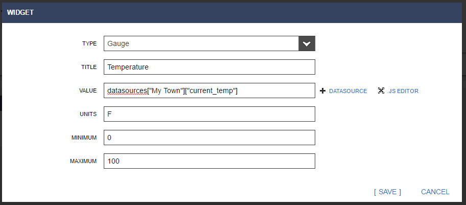

## Data Monitoring powered by BugLabs

### Step 1 

* Take the board out of the box and connect the USB port on the board to a USB port on your laptop.  This will power up the board and the board will enumerate as a USB drive on your laptop.  

> NOTE: The board will not show up as a USB drive on Macs. You only need to complete Step 2 to get one file off the board with the device name. After that, the USB is only for power. Once you get the name from "ThingName.txt" file, you can use a 
Mac to view the dashboard.

* Now connect the Ethernet port on the board to an Ethernet port on a network router which is internet enabled. 

### Step 2 

* Click on the USB drive which represents your board.  

* Find the “ThingName.txt” file and open it.  The file will contain the Thing Name for your board.  
* Now open a web browser and go to www.renesas.com/iotsandbox/S5D9/getstarted.  
* Enter your board’s Thing Name into the field marked “Enter Thing Name here…” and press the “Try it now!” button. 

At this point, you should see sensor data from your board streaming to the dashboard at an update rate of approximately once per second.

> NOTE: if you don't see any sensor data after 3 minutes, unset and then set your Board ID again.

You can shake the board to watch the accelerometer readings change or snap your fingers and watch the sound level change.  You can also click on the button in the browser marked “RED LED” and watch it turn on the LED on your board.  

## Using Freeboard

[Freeboard](https://renesas.freeboard.io) is a web-based visualization tool used for displaying and interacting with data. Freeboard is open-source and fully-customizable, allowing the user to create rich Internet of Things applications.

Sign up for a Renesas Freeboard account to do more:
[https://renesas.freeboard.io/signup](https://renesas.freeboard.io/signup)

### Already Have a Freeboard Account?

If you already have a Freeboard account through Renesas, you must sign in through 

[https://renesas.freeboard.io/login](https://renesas.freeboard.io/login)

If you get lost, just remember to go to 
[https://renesas.freeboard.io/](https://renesas.freeboard.io/)

### Datasources

Your Renesas Synery Kit comes with software that allows the device to connect to the [dweet messaging platform](https://dweet.io).

The dweet platform is one possible datasource that freeboard can use to display data. Your custom dashboard will already be set up with this datasource, titled Renesas-Dweet (This is a custom instance of dweet supplied by Bug Labs, to Renesas. Further customization is available upon request). 

To add a new datasource, such as a 3rd party API, Click on the ADD button.

Next, choose the datasource you wish to connect. For example, choose the JSON datasource to add a 3rd party web API. In the following example, we choose the Weather datasource.

Fill out the appropriate details, and click on SAVE.

### Widgets

The freeboard platform comes with a standard set of widgets to use for visualizing data.  To add a new widget to your dashboard, click on the Add Pane button:

A new pane will be added to the top left of your dashboard. 

Click on the + sign in the header of your new pane.  A selection popup will appear:

Select the widget type you wish to use (in our case we use the gauge).

Fill out the information in the widget setup screen, then click SAVE.

Next step, keep adding more datasources and widgets, then Share your dashboard.

One last note: Bug Labs provides a set of off-the-shelf widgets to use, however, the user is able to add new widgets and datasource types by adding plugins to the Developer Console.

Documentation for creating new plugins can be found within the Developer Console.

## Location Simulation
Go to this link and enter your thing name in the box on the upper left corner.

[https://renesas.freeboard.io/board/cSyXRK](https://renesas.freeboard.io/board/cSyXRK)

## Helpful Links

* [Freeboard Open Source Repo](https://github.com/Freeboard/freeboard)
* [DweetPro Production ready APIs and UI](https://dweetpro.io)
* [Data Monitoring developer area](https://renesas.dweet.io/) 

