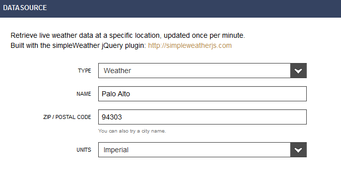

## Data Monitoring powered by BugLabs

## Learning Objectives

* Connect S5D9 to Renesas Data Monitoring Dashboard (Freeboard)
* View sensor data in pre-made dashboard
* Create custom dashboard using your S5D9 as the data source
* Add third-party APIs to your dashboard. You'll use a public weather API
* Understand geotagging and map display by using a pre-built demo

> NOTE: Another guide will show you how to use a simple REST API to access the S5D9 sensor data in JSON format.

## Connect Board to USB and Ethernet

* Take the board out of the box and connect the USB port on the board to a USB port on your laptop.  This will power up the board and the board will show up as a USB drive on your laptop.  

> NOTE: The board will not show up as a USB drive on Macs. 

You only need to get one file off the board, the "ThingName.txt" file. After that, the USB is needed, but only for power. 

## Get Your Thing Name

If you're in the Learn IoT workshop, your board already has the Thing Name on a sticker on the back side.

The syntax is case sensitive and will be S5D9-xxxx ("S5D9 on the left, a dash, and then a combination of four numbers and letters on the right).

* Click on the USB drive which represents your board.  

* Find the “ThingName.txt” file and open it.  The file will contain the Thing Name for your board. 

* Now connect the Ethernet port on the board to an Ethernet port on a network router which is internet enabled. 

## Access S5D9 Sensor Data on Renesas Data Monitoring Dashboard 

* Now open a web browser and go to [www.renesas.com/iotsandbox/S5D9/getstarted](www.renesas.com/iotsandbox/S5D9/getstarted). 

* Enter your board’s Thing Name into the field marked “Enter Thing Name here…” and press the “Try it now!” button. 

At this point, after just a few seconds, you should see sensor data from your board streaming to the dashboard at an update rate of approximately once per second.

> NOTE: if you don't see any sensor data after 3 minutes, unset and then set your Board ID again.

Terminology: The Renesas Data Monitoring Dashboard is also referred to as *Freeboard*

You can shake the board to watch the accelerometer readings change or snap your fingers and watch the sound level change.  You can also click on the button in the browser marked “RED LED” and watch it turn on the LED on your board.  

## Using Renesas Data Intelligence Dashboard (Freeboard)

[Freeboard](https://renesas.freeboard.io) is a web-based visualization tool used for displaying and interacting with data. Freeboard is open-source and fully-customizable, allowing the user to create rich Internet of Things applications.

Sign up for a Renesas Freeboard account to do more:
[https://renesas.freeboard.io/signup](https://renesas.freeboard.io/signup)

### Already Have a Renesas Freeboard Account?

If you already have a Freeboard account through Renesas, you must sign in through 

[https://renesas.freeboard.io/login](https://renesas.freeboard.io/login)

If you get lost, just remember to go to 
[https://renesas.freeboard.io/](https://renesas.freeboard.io/)

### Create a New Renesas Freeboard

### Datasources

Your Renesas S5D9 IoT Fast Prototyping Kit comes with software that allows the device to connect to 
the [dweet messaging platform](https://dweet.io). We'll focus on connecting your Renesas board and a
few other data sources to Freeboard. We will not connect your mobile phone to Freeboard.

If you see the box below, close it.

The dweet platform is one possible datasource that freeboard can use to display data. Your dashboard may already be set up with this datasource, titled Renesas-Dweet. If 
it is, skip the next step. 

### Add Your Renesas S5D9 As the Data Source

Click *Add* to create a new data source.

Select *Renesas Dweet* as the *TYPE*.

Specify your personal Thing Name that was on the ThingName.txt file on your
board. If you're in an IoTcommunity.io workshop, the Thing Name may be 
on a sticker on the back of the board. The name of the Dweet can be anything.
We'll name it Renesas-Dweet to make it easy to understand. Leave the key blank.

Immediately after I create my data source, it's automatically updated. My board is 
plugged into Ethernet and sending data.

Add a pane.

Add widget.

Select gauge.

Fill in details.

Create gauges for Y and Z acceleration.

Add sound sparkline and clap next to board.

Add temperature and any other sensors.

### Add a 3rd party API as Data Source

To add another datasource, such as a 3rd party API, Click on the ADD button.

Next, choose the datasource you wish to connect. For example, choose the JSON datasource to add a 3rd party web API. In the following example, we choose the Weather datasource.

Fill out the appropriate details, and click on SAVE.

### Add New Pane and Widget to Pane

Add Pane.

 

Click on the + sign in the header of the new pane.  A selection popup will appear:

Select the widget type you wish to use (in our case we use the gauge).
Fill out the information in the widget setup screen, then click SAVE.

After you hit SAVE, the gauge will appear in your dashboard.

Here's the full dashboard. If you see the configuration panel, then click on the
wrench in the middle top of the screen to hide it.

Add more datasources and widgets, then Share your dashboard.

### Developer Console to Add New Widgets and Data Sources

You can also add new widgets and datasource types by adding plugins to the Developer Console.

[Documentation for creating new plugins](http://freeboard.github.io/freeboard/docs/plugin_example.html) can be found within the Developer Console.

## Location Simulation
Go to this link and enter your thing name in the box on the upper left corner.

[https://renesas.freeboard.io/board/cSyXRK](https://renesas.freeboard.io/board/cSyXRK)

## Helpful Links

* [Freeboard Open Source Repo](https://github.com/Freeboard/freeboard)
* [DweetPro Production ready APIs and UI](https://dweetpro.io)
* [Data Monitoring developer area](https://renesas.dweet.io/) 

