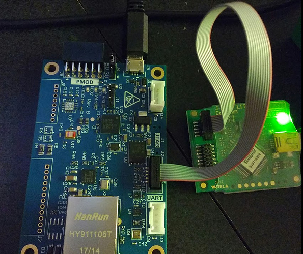

# Hacking requirements

## OS 
As of 7/29/2017, the board cannot mount on a Mac.  You need Windows 7 or 10
to really use the board and tools. You can mount the board on Linux, but you
will not be able to use Synergy. 

## Data Monitoring and Data Intelligence

- Ethernet with Internet access
- USB cable to power the board (you can power it from your laptop)
- web browser to display dashboard 

## Synergy
- [Synergy Software Package (SSP)](https://synergygallery.renesas.com/ssp)
- [e2 Studio ISDE](https://synergygallery.renesas.com/isde)

## Restoring Factory Image
- [S5 LCM Bootloader Factory Image](http://learn.iotcommunity.io/t/s5d9-iot-fast-prot-kit-factory-image-files-updated/1091)
- USB cable
- jumper and wires

## Building new binary
- Synergy
- USB cable

## Replacing Bootloader

- [J-Link Software](https://www.segger.com/downloads/jlink/) pack that contains J-Flash Lite
- SEGGER J-Link JTAG debugger

The unit below came with the S3A7 IoT Fast Prototyping Kit. I heard that it normally 
costs $30 separately. The unit below works.

I went online and saw similar units on sale on eBay for $11 to $17. I do not know if 
any of the units on eBay work. If you have a unit that works, please post information.

## Designing Your Own Board
- [Design files for S5D9 IoT Fast Prototyping Kit](http://learn.iotcommunity.io/t/s5d9-iot-fast-prot-kit-board-design-files/1104)
- PCB design software like Altium Designer, Eagle, or many others
- Manufacturing partner like [Seeed Studio Fusion](https://www.seeedstudio.com/fusion.html)