## Building a Custom Blinky

Blinky is the Hello World of embedded boards. This will replace your factory image
with a new custom image that makes the onboard LEDs blink. Before you go any 
further, verify that you can restore the factory image of your board. Read the
overview of [creating a custom board image](custom.md).

### e2 Studio

Start e2 Studio.

Create a new workspace.

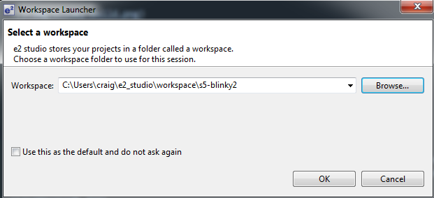

Go to the Workbench.

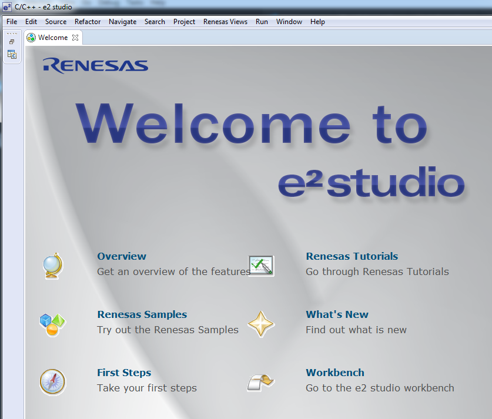

Go to the Project Explorer view.

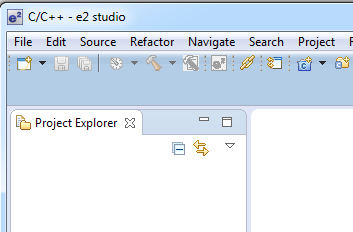

File -> New - Synergy C Project

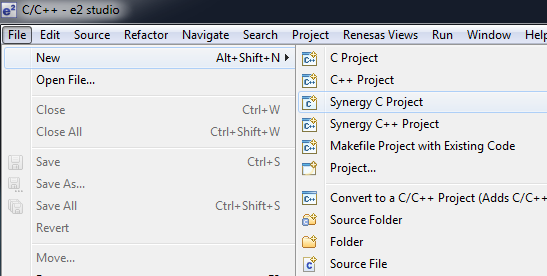

Specify a project name.

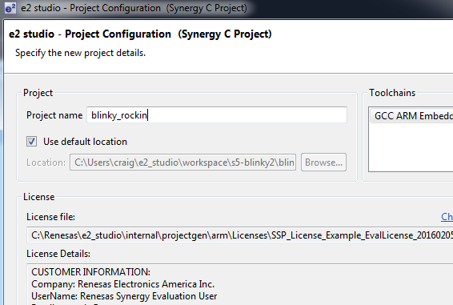

Configure your Synergy Project

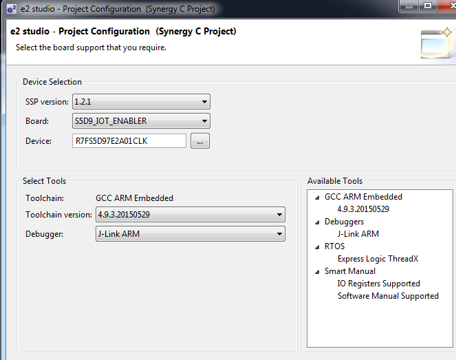

**Important:** Your board must be S5D9_IOT_ENABLER. If this option does not come up, you
will need to install the Board Support Package. See the previous section on 
[Software Configuration](custom/#software-configuration)

Select Blinky as the Project Template.

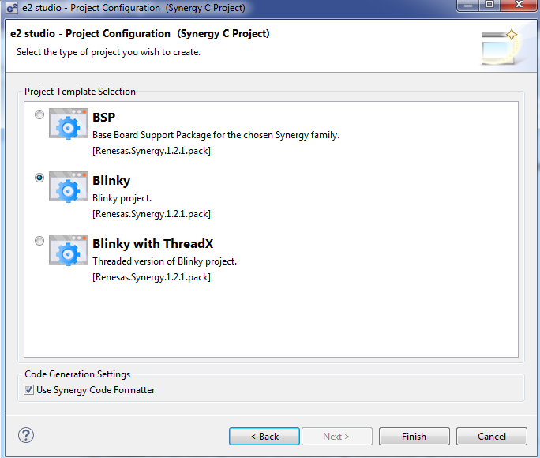

Enter the Synergy Configuration perspective and look for the BSP tab.

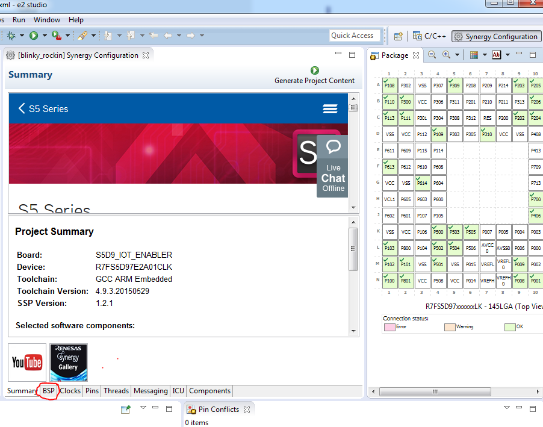

In the BSP tab, make sure you have the proper Board and Device.

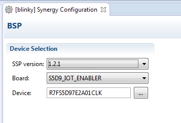

Select Build.

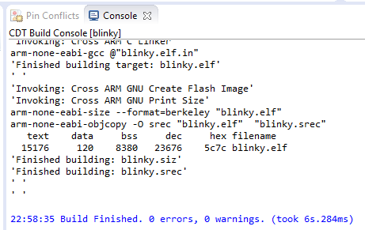

The `.srec` file will be placed in the `Debug` folder.

If your board is connected to the J-Link debugger, can now press Debug and the binary will move over to your board. 

You can also use a separate tool called, J-Flash Lite. To make the process easier to learn as a 
step by step process, I'm going to
break the process into two steps, build and then flash. I'm going to show you how to use J-Flash Lite to
to move the binary over. When you're actively building and debugging, you can use e2 Studio to manage
the process automatically.

### Using J-Flash Lite

#### Connect debugger board 

- Connect debugger board to Windows workstation with USB cable
- Connect debugger board to Renesas S5D9 board with ribbon cable and JTAG connector
- Connect Renesas S5D9 board to USB power source (such as your computer's USB port)

#### Configure J-Flash Lite

Open J-Flash Lite. If you do not have J-Flash Lite installed, download the [J-Link Software](https://www.segger.com/downloads/jlink/) pack from SEGGER.

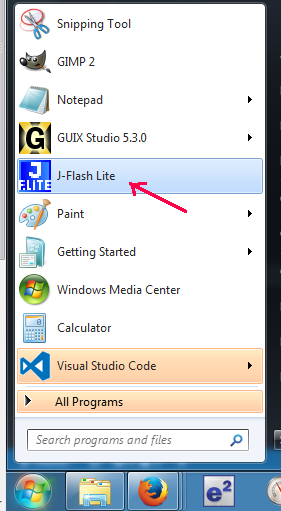

When J-Flash starts, you'll need to specific the Device and Interface. You may also need to
update your driver.

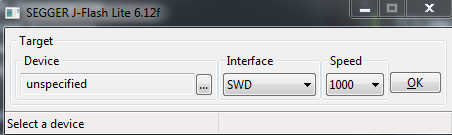

Plug in the SEGGER debugger board into your Windows computer and it will automatically
install the J-Link driver.

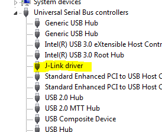

Update the driver (optional).

The specific Renesas MCU used in the S5D9 IoT Fast Prototyping Kit is:

    R7FS5D97E2A01CLK

Select Renesas, R7FS5D97E.

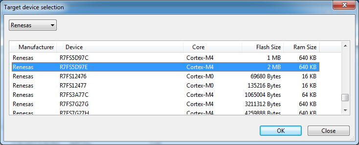

Select JTAG for Interface.

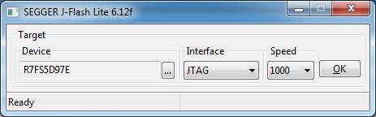

Select the `.srec` binary to upload.

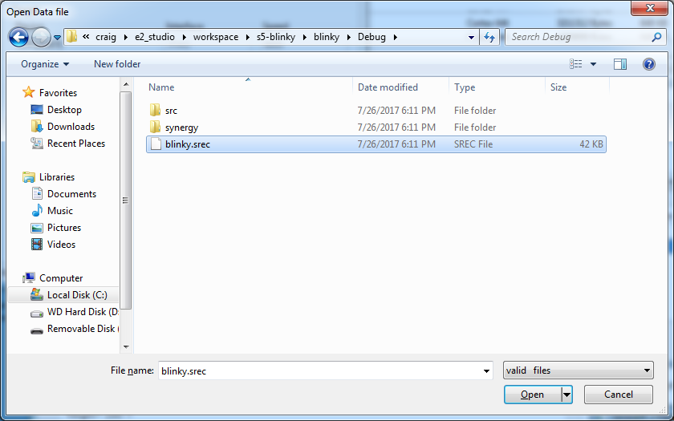

Flash the board. See the blink. The default blinky flashes all three LEDs.

<iframe width="560" height="315" src="https://www.youtube.com/embed/y8aBY0ZYQAc" frameborder="0" allowfullscreen></iframe>