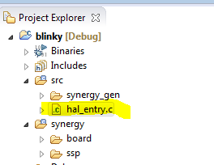
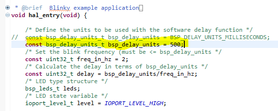
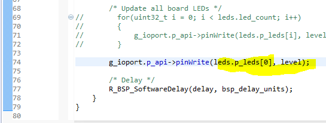

## Modding Blinky

This will guide you through simple modifications of the blinky template application
to get more familiar with editing C code with e2 Studio and transferring the binary
to your board.

### Modify Blink Rate

In `hal_entry.c` change the `bsp_delay_units_t` to your favorite millisecond delay. I'm using 500ms delay.

Look for `bsp_delay_units`. 

<iframe width="560" height="315" src="https://www.youtube.com/embed/_fXya_Rx5Lg" frameborder="0" allowfullscreen></iframe>

## Modifying Which LED Blinks 

in `hal_entry.c` comment out the `for` loop that displays all LEDs and select the LEDs you want to blink with one or more of these array elements:

- `leds.p_leds[0]`
- `leds.p_leds[1]`
- 'leds.p_leds[2]`

I'm going to flash only the green LED, `leds.p_leds[0]`

<iframe width="560" height="315" src="https://www.youtube.com/embed/8H9B5rBN7po" frameborder="0" allowfullscreen></iframe>

## Alternating Blink between two LEDs

In order to alternate LEDs, you need to flip the state of at least LED. If the LED is *on* then turn it off.
If you use one statement to flip all the LEDs to on, then all LEDs will go on, regardless of the
initial state. In this example, the level is a boolean variable. 

I'm using the template conditional to flip the third LED and have a different conditional to
change the state of the first LED. 

This is just to show you the old code and the new code in the same snippet. 

All LEDs are off when the board boots. If I set the first LED to true, then led[0] and led[2] will alternate.

     bool level_0 = true;

        while(1)
        {

            /* Determine the next state of the LEDs */
            if(IOPORT_LEVEL_LOW == level)
            {
                level = IOPORT_LEVEL_HIGH;
            }
            else
            {
                level = IOPORT_LEVEL_LOW;
            }

            /* Update all board LEDs */
    //        for(uint32_t i = 0; i < leds.led_count; i++)
    //        {
    //            g_ioport.p_api->pinWrite(leds.p_leds[i], level);
    //        }

            g_ioport.p_api->pinWrite(leds.p_leds[2], level);
            g_ioport.p_api->pinWrite(leds.p_leds[0], level_0);

            if(level_0)
            {
                level_0 = false;
            }
            else
            {
                level_0 = true;
            }

            /* Delay */
            R_BSP_SoftwareDelay(delay, bsp_delay_units);
        }

<iframe width="560" height="315" src="https://www.youtube.com/embed/bLeTWXHZIlk" frameborder="0" allowfullscreen></iframe>