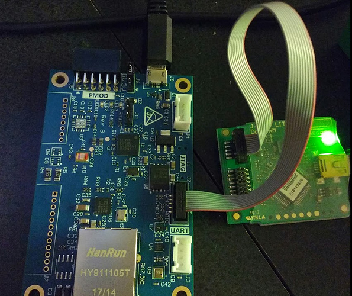
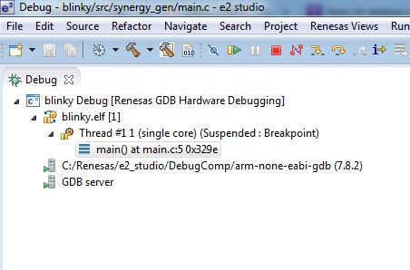
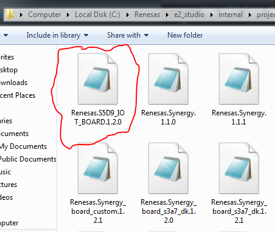

## Creating a Custom Board Image

### Caution and Warning
Before you replace the board image, make sure you can 
[restore the board with the factory image](http://learn.iotcommunity.io/t/restoring-factory-image-on-s5d9-iot-fast-prototyping-kit/1079).
If you can't restore your board, you may brick the board. 

You will lose this functionality (which can be restored):

- Data Monitoring dashboard (Bug Labs) access will be wiped
- Data Intelligence (Medium One) binaries will not load from the `Put binary here` folder
- You will lose all factory bootloader functionality (the `update.txt` method will no longer work)
- You will lose any data and files stored to flash

**Do not use this method unless you are comfortable with embedded development and feel 
confident that you can restore your board**

### Hardware Software Requirements

After you are confident you can restore your factory system image, acquire these components.

** C/C++ development tools **

- [Synergy Software Package (SSP)](https://synergygallery.renesas.com/ssp)
- [e2 Studio ISDE](https://synergygallery.renesas.com/isde)

** Debug and Flash **

- [J-Link Software](https://www.segger.com/downloads/jlink/) pack that contains J-Flash Lite
- SEGGER J-Link JTAG debugger

I am using the J-Link JTAG debugger that was included in the Renesas S3A7 IoT Fast Prototyping Kit.
The S5D9 IoT Fast Prototyping Kit does not come with a J-Link JTAG debugger and is intended to be
used with the existing bootloader. You can still use Synergy to create custom `.srec` files with the
existing bootloader and you don't need a J-Link debugger. This section is primarily for people
that already have a J-Link JTAG debugger and don't need to buy a new one.

The USB on the S5D9 is only for power. The J-Flash board connects to your computer with USB. Once
the board is connected to your computer with USB, you can use the e2 Studio debugger tools and 
transfer the `.srec` file from inside of e2 Studio. You can also set break points and step through
your code.

### e2 Studio and SSP

Install e2 studio. I'm using 5.4.0.018.  ([download](https://synergygallery.renesas.com/isde)).

Install SSP. I'm using v1.2.1 ([download](https://synergygallery.renesas.com/ssp/package#read)). 

### Software Configuration

You will need the [S5D9 IoT Fast Protyping Kit Board Support Package (BSP)](http://learn.iotcommunity.io/t/s5d9-iot-fast-prot-kit-synergy-board-support-package-bsp/1106).

Put the file into your e2 Studio Packs folder

The default install location is:

    C:\Renesas\e2_studio\internal\projectgen\arm\Packs

