Medium One has the source code for their Diagnostics Intelligence project and and the Board Support Package file in their [GitHub repository](https://github.com/Medium-One/diagnostics-intelligence-s5d9). This source code is for building a `.srec` that uses the factory bootloader on the board. The `Put binary here` folder.

##  How to Build Medium One Diagnostics Intelligence 

## Updating Components
The code requires SSP v1.2.1 ([download](https://synergygallery.renesas.com/ssp/package#read)). I'm updating my SSP from v1.2.0 to v1.2.1

The SSP v1.2.1 requires e2 studio 5.4.0.018 or later. I'm also upgrading e2 Studio ([download](https://synergygallery.renesas.com/isde)).

I next downloaded the Medium One Cloud Agent for Synergy SSP 1.2.x installed. ([download](https://synergygallery.renesas.com/addon))

## Download Code From GitHub

I'm  using git from the command line using git bash on Windows 10. You can also download the zipped project from GitHub and extract the contents.

## Extract Medium One Cloud Agent

I extracted the Medium_One_Cloud_Agent_and_Demo into the `m1` folder. I'm leaving the m1-20161103 file zipped.

## Move IOT Board Pack into e2 Studio

Assuming you installed e2 Studio into the default location, look for 

    C:\Renesas\e2_studio\internal\projectgen\arm\Packs

## Import Project Into e2 Studio
After you start e2 Studio, go to File -> Import

Select *General*

Select *Rename & Import Existing C/C++ Project into Workspace*

Select root directory. Browse to the folder that contains the diagnostics intelligence project you downloaded from GitHub.

Click Finish.

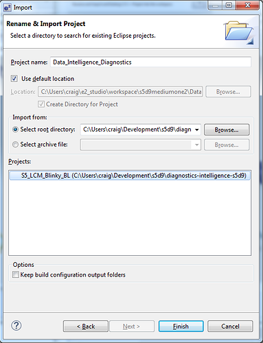

You will see a popup in the lower right corner indicating *Synergy License Required*.

Set up the license. 

Browse for the License file.

Press *Browse* again.

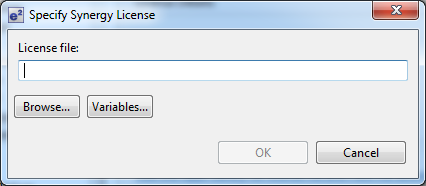

Select SSP_License_Example_EvalLicense_....

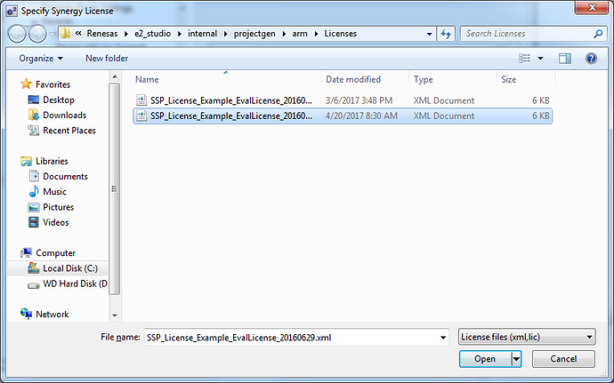

Click *OK*.

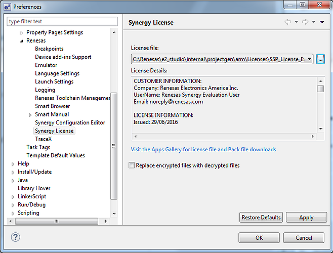

Close the Welcome Panel.

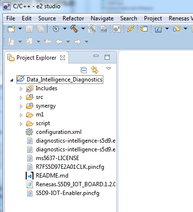

Create a Synergy Configuration perspective. 

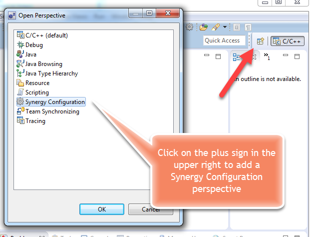

In the Synergy Configuration perspective, click on `configuration.xml`, which is in the left panel.

Once it's open, click on **Generate Project Content**

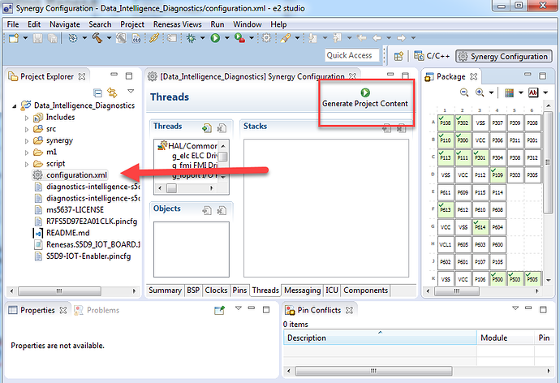

this is the BSP panel

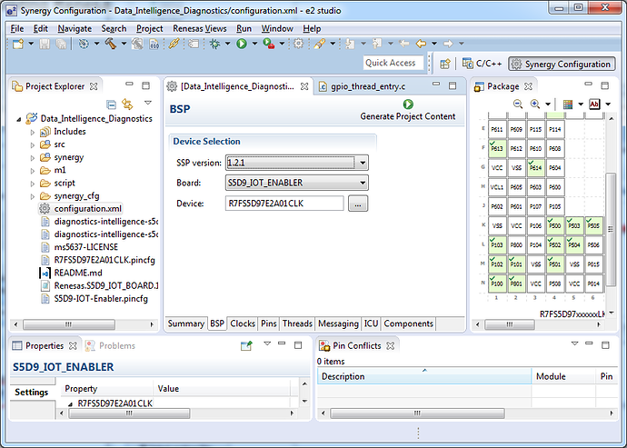

Build it.

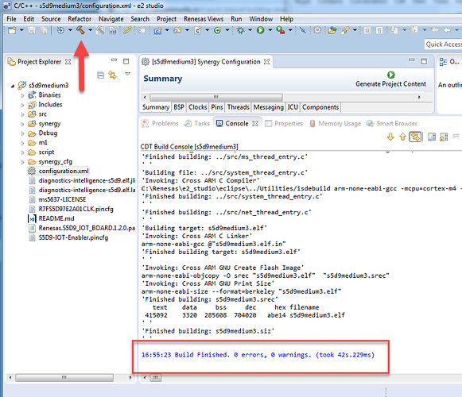

When the build is finished, you will get a status message that the build finished with 0 errors and 0 warnings.  During the build, you will see the status window below.

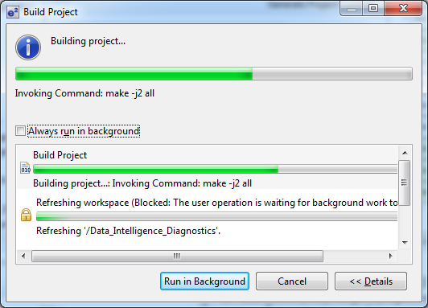

## Transfer Compiled .srec

The compiled `.srec` file is in your Debug folder. Use Windows File browser to copy this into the `Put binary here` folder of your S5D9.

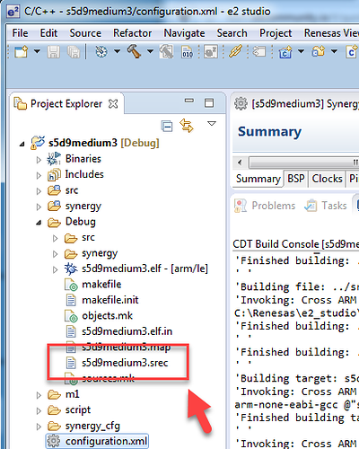

These are the files in your development folder on Windows.

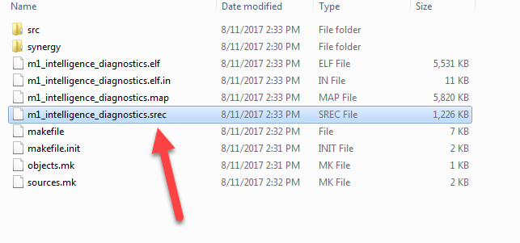

The file is probably in e2_studio -> workspace

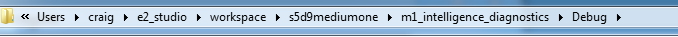

This is the file structure of your S5D9

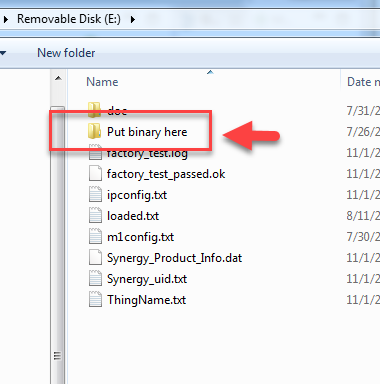

You need to delete `loaded.txt` and put the name of the binary in a new text file called `update.txt`. See 
[this guide](http://learn.iotcommunity.io/t/renesas-s5d9-new-binary-install/969) for more information.
